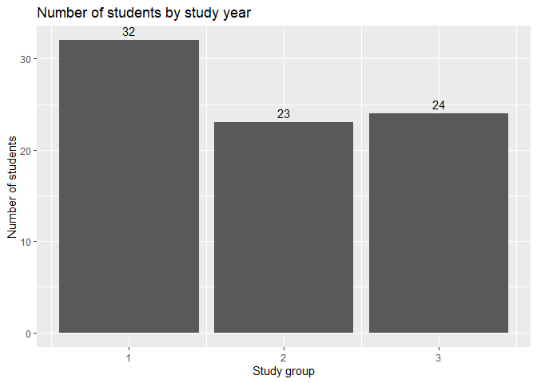
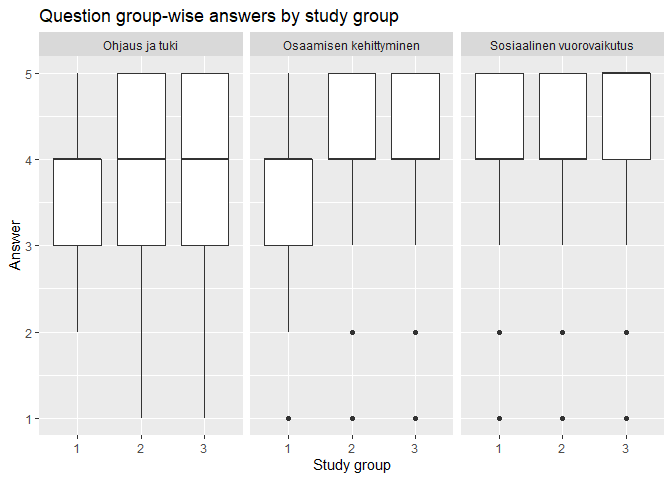
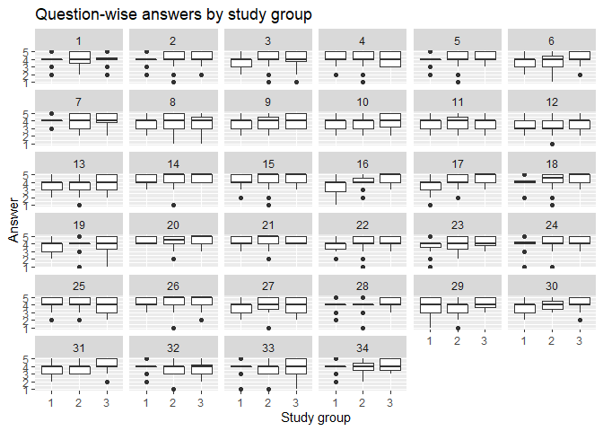
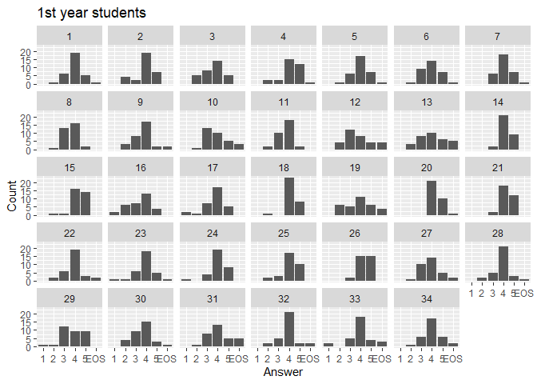
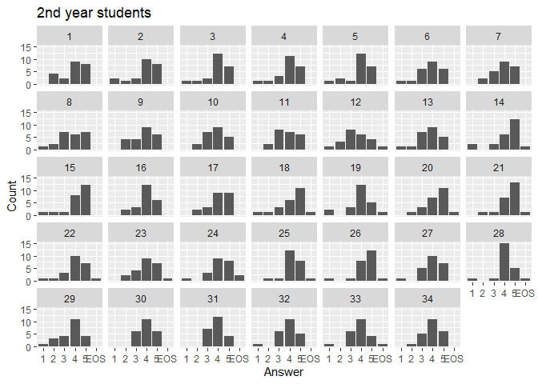
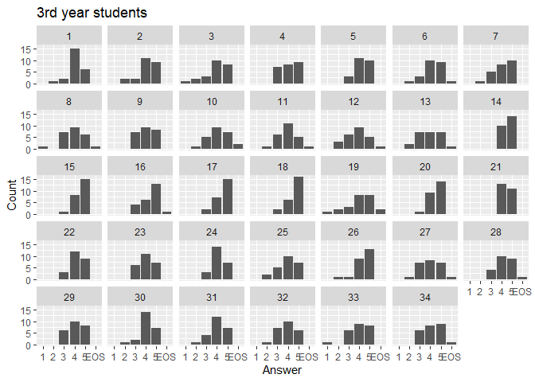
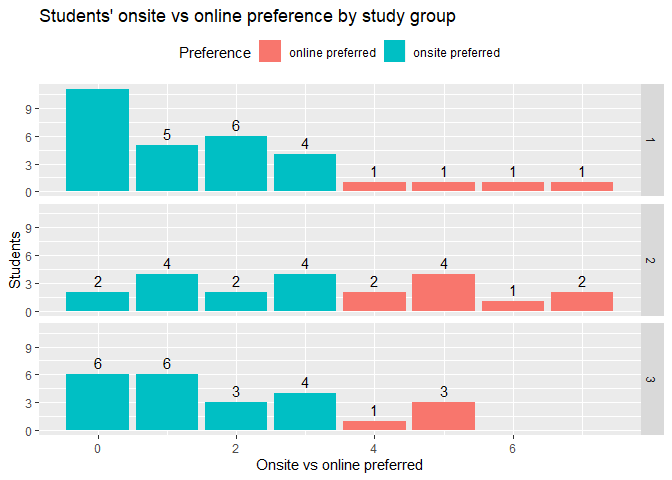

Webpropol answers 2020
================
Essi Viippola
7.2.2021

## Data description

  - Number of students: 79
  - Number of likert questions: 34
  - Number of non-likert questions: 5

The distribution of answers by study year is presented below.

``` r
ggplot(nonlikert, aes(x=study_group)) + 
  geom_bar() +
  geom_text(stat="count", aes(label=..count..), vjust=-0.5) +
  labs(x="Study group", y="Number of students", title="Number of students by study year")
```

<!-- -->

## Likert questions

### Difference between study groups

The first year students seemed to be the most critical in their answer.

``` r
ggplot(likert %>% filter(!is.na(answer)), aes(x=factor(study_group), y=answer)) + 
  geom_boxplot() + 
  facet_grid(.~question_group) +
  labs(x="Study group", y="Answer", title="Question group-wise answers by study group")
```

<!-- -->

``` r
ggplot(likert %>% filter(!is.na(answer)), aes(x=factor(study_group), y=answer)) + 
  geom_boxplot() + 
  facet_wrap(~as.numeric(question_number)) +
  labs(x="Study group", y="Answer", title="Question-wise answers by study group")
```

<!-- -->

``` r
ggplot(likert %>% filter(study_group==1) %>% mutate(answer = ifelse(is.na(answer), "EOS", answer)), aes(x=answer)) + 
  geom_bar() + 
  facet_wrap(~as.numeric(question_number), nrow=5) +
  labs(x="Answer", y="Count", title="1st year students")
```

<!-- -->

``` r
ggplot(likert %>% filter(study_group==2) %>% mutate(answer = ifelse(is.na(answer), "EOS", answer)), aes(x=answer)) + 
  geom_bar() + 
  facet_wrap(~as.numeric(question_number), nrow=5) +
  labs(x="Answer", y="Count", title="2nd year students")
```

<!-- -->

``` r
ggplot(likert %>% filter(study_group==3) %>% mutate(answer = ifelse(is.na(answer), "EOS", answer)), aes(x=answer)) + 
  geom_bar() + 
  facet_wrap(~as.numeric(question_number), nrow=5) +
  labs(x="Answer", y="Count", title="3rd year students")
```

<!-- -->

## Can not say

``` r
tbl = likert %>% group_by(question_group, study_group) %>% summarize(total_answers = n(), missing_answers = sum(is.na(answer)), missing_pct = round(missing_answers / total_answers * 100, 1))

names(tbl) = c("Question group", "Study group", "Total answers", "Missing answers", "Missing answers (%)")

knitr::kable(tbl)
```

| Question group            | Study group | Total answers | Missing answers | Missing answers (%) |
| :------------------------ | ----------: | ------------: | --------------: | ------------------: |
| Ohjaus ja tuki            |           1 |           416 |              19 |                 4.6 |
| Ohjaus ja tuki            |           2 |           299 |               1 |                 0.3 |
| Ohjaus ja tuki            |           3 |           312 |               7 |                 2.2 |
| Osaamisen kehittyminen    |           1 |           384 |              17 |                 4.4 |
| Osaamisen kehittyminen    |           2 |           276 |               7 |                 2.5 |
| Osaamisen kehittyminen    |           3 |           288 |               3 |                 1.0 |
| Sosiaalinen vuorovaikutus |           1 |           288 |               7 |                 2.4 |
| Sosiaalinen vuorovaikutus |           2 |           207 |               6 |                 2.9 |
| Sosiaalinen vuorovaikutus |           3 |           216 |               3 |                 1.4 |

## Onsite vs online learning

72 % of students preferred onsite learning over online learning.

``` r
ggplot(nonlikert %>% filter(!is.na(preferred_method)), aes(x=preferred_method, fill=ifelse(preferred_method <= 3, "onsite preferred", "online preferred"))) + 
  geom_bar() + 
  facet_grid(study_group~.) +
  geom_text(stat="count", aes(label=..count..), vjust=-0.5) +
  labs(x="Onsite vs online preferred", y="Students", fill="Preference", title="Students' onsite vs online preference by study group") +
  theme(legend.position = "top")
```

<!-- -->
